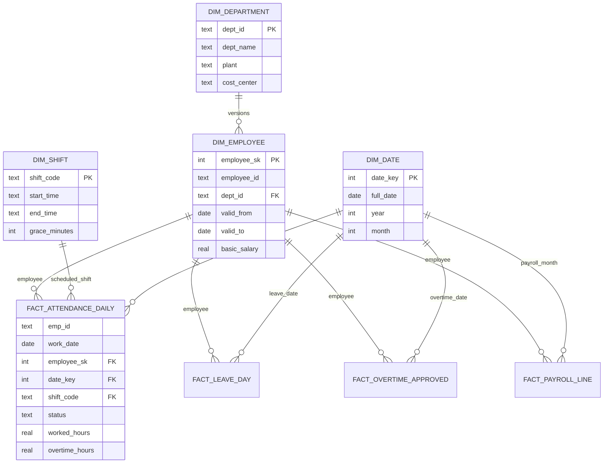

# Warehouse ER diagram

```mermaid
erDiagram
  DIM_DEPARTMENT ||--o{ DIM_EMPLOYEE : versions
  DIM_EMPLOYEE ||--o{ FACT_ATTENDANCE_DAILY : employee
  DIM_SHIFT ||--o{ FACT_ATTENDANCE_DAILY : scheduled_shift
  DIM_DATE ||--o{ FACT_ATTENDANCE_DAILY : work_date
  DIM_EMPLOYEE ||--o{ FACT_LEAVE_DAY : employee
  DIM_DATE ||--o{ FACT_LEAVE_DAY : leave_date
  DIM_EMPLOYEE ||--o{ FACT_OVERTIME_APPROVED : employee
  DIM_DATE ||--o{ FACT_OVERTIME_APPROVED : overtime_date
  DIM_EMPLOYEE ||--o{ FACT_PAYROLL_LINE : employee
  DIM_DATE ||--o{ FACT_PAYROLL_LINE : payroll_month
  DIM_DEPARTMENT {
    text dept_id PK
    text dept_name
    text plant
    text cost_center
  }
  DIM_SHIFT {
    text shift_code PK
    text start_time
    text end_time
    int grace_minutes
  }
  DIM_DATE {
    int date_key PK
    date full_date
    int year
    int month
  }
  DIM_EMPLOYEE {
    int employee_sk PK
    text employee_id
    text dept_id FK
    date valid_from
    date valid_to
    real basic_salary
  }
  FACT_ATTENDANCE_DAILY {
    text emp_id
    date work_date
    int employee_sk FK
    int date_key FK
    text shift_code FK
    text status
    real worked_hours
    real overtime_hours
  }
```
